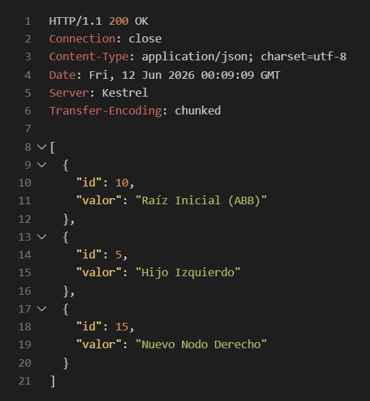
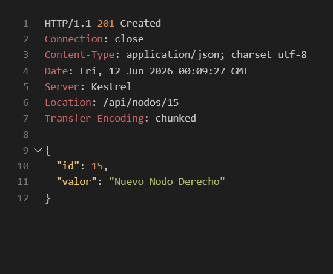
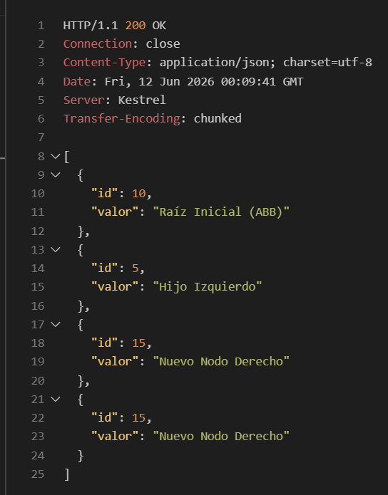

# Actividad: Estructuras de Datos Avanzadas y APIs con ASP.NET Core

## Parte 1: Investigación Teórica

### 1. Estructuras de Datos Eficientes

*   **Árboles Binarios de Búsqueda (ABB):**
    *   **Regla de ordenamiento:** En un ABB, para cada nodo, todos los elementos en su subárbol izquierdo son menores que el valor del nodo, y todos los elementos en su subárbol derecho son mayores.
    *   **Principal desventaja:** Si los datos se insertan en un orden secuencial (ya sea ascendente o descendente), el árbol se degenera convirtiéndose en una lista vinculada (una sola rama). Esto provoca que la complejidad de las operaciones pase de $O(\log n)$ a $O(n)$, perdiendo la eficiencia de la estructura arbórea.

*   **Árboles AVL:**
    *   **Árbol auto-balanceado:** Es un árbol binario de búsqueda que ajusta automáticamente su estructura tras cada inserción o eliminación para asegurar que su altura se mantenga logarítmica respecto al número de nodos.
    *   **Factor de balanceo:** Es la diferencia entre la altura del subárbol izquierdo y la altura del subárbol derecho ($Factor = Altura_{Izquierda} - Altura_{Derecha}$). En un árbol AVL, este factor siempre debe ser -1, 0 o 1.
    *   **Complejidad:** Al aplicar rotaciones para mantener el factor de balanceo dentro de los límites permitidos, la altura del árbol nunca supera el logaritmo del número de nodos, garantizando que el tiempo de búsqueda, inserción y eliminación sea siempre $O(\log n)$ en el peor de los casos.

### 2. Fundamentos de Web APIs

*   **API y Modelo Cliente-Servidor:**
    *   **API (Application Programming Interface):** Es un conjunto de reglas y protocolos que permite a diferentes aplicaciones de software comunicarse entre sí. En el contexto web, expone funcionalidades o datos a través de URLs.
    *   **Modelo Cliente-Servidor:** Un cliente (como un navegador o Postman) envía una **Petición (Request)** a través de la red utilizando el protocolo HTTP hacia un Servidor. El servidor procesa esta petición, interactúa con la lógica o la base de datos necesaria, y devuelve una **Respuesta (Response)** (por ejemplo, en formato JSON) al cliente, que incluye un código de estado indicando el éxito o fracaso de la operación.

*   **Verbos HTTP:**
    *   **GET (Recuperación de recursos):** Se utiliza exclusivamente para solicitar o leer datos del servidor sin modificarlos.
        *   *Idempotencia:* Sí. Realizar la misma petición GET varias veces seguidas produce el mismo resultado y no altera el estado del servidor.
    *   **POST (Creación de nuevos recursos):** Se emplea para enviar datos al servidor con el fin de crear un nuevo recurso o entidad.
        *   *Idempotencia:* No. Ejecutar la misma petición POST múltiples veces típicamente creará múltiples recursos idénticos, cambiando el estado del servidor en cada ocasión.

---

## Parte 3: Verificación y Pruebas (Capturas)

*(Agrega tus capturas de pantalla de Postman, Bruno o REST Client debajo de cada punto)*

### 1. Prueba del GET

**Petición y Respuesta:**

### 2. Prueba del POST

**Petición de creación (Status 201):**

**Verificación con nuevo GET (Status 200 con el nuevo nodo):**

