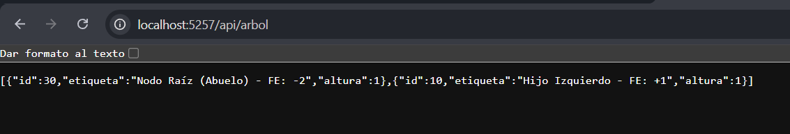
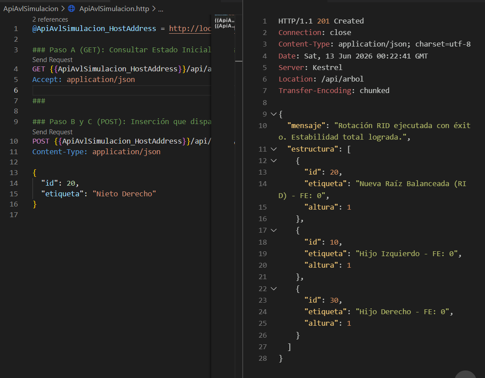
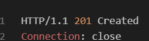

# Resolución de Actividad: Balanceo Compuesto en Árboles AVL y Exposición vía Web APIs

## Parte 1: Investigación Teórica y Análisis de Casos

### 1. El Límite de las Rotaciones Simples y Desbalanceo en "Zig-Zag"

*   **El Problema Cruzado:** Las rotaciones simples (como RLL o RRD) fallan en casos de desbalanceo en "zig-zag" (como insertar 30, luego 10, y luego 20). En este escenario, una rotación simple sólo traslada el desbalance hacia el otro lado sin lograr el equilibrio (cambia la inclinación pero no la reduce).
    *   **Condición matemática:** Se gatilla una Rotación Doble Izquierda-Derecha (RID) cuando el Factor de Equilibrio (FE) del nodo desbalanceado (abuelo) es **-2** (pesado a la izquierda) y el FE de su hijo izquierdo es **+1** (pesado a la derecha).
*   **Principio DRY (Don't Repeat Yourself):** Implementar operaciones compuestas como RID (Rotación Izquierda-Derecha) y RDI (Rotación Derecha-Izquierda) llamando a las primitivas de rotación simple tiene la ventaja de reusar código ya probado. Evita escribir reasignaciones manuales de punteros desde cero, lo que reduce la probabilidad de introducir errores y hace que el código sea mucho más robusto, fácil de leer y mantener.

### 2. Fundamentos de Arquitectura Web y Protocolo HTTP

*   **El Modelo Cliente-Servidor:** En una arquitectura web, el **cliente** (por ejemplo, un navegador web, Postman, o curl) realiza una petición HTTP (**Request**) hacia el **servidor**. Esta petición contiene un método HTTP, una URL, cabeceras y (a veces) un cuerpo de datos. El servidor recibe, enruta y procesa la petición para finalmente devolver una respuesta HTTP (**Response**) al cliente, que contiene un código de estado (ej. 200 OK, 201 Created) y típicamente el recurso solicitado o el resultado de la operación (usualmente serializado en formato JSON).
*   **Semántica de Operaciones:** 
    *   **GET:** Es un método diseñado exclusivamente para la **recuperación o lectura** de datos. No debe modificar el estado del servidor (es una operación segura e idempotente).
    *   **POST:** Es un método diseñado para la **mutación o inserción** de nuevos elementos en el servidor. Envía datos al servidor para que sean procesados, lo que a menudo resulta en la creación de un nuevo recurso.

---

## Parte 2: Pruebas de Funcionamiento (Testing)

A continuación, se presentan las capturas de pantalla de la API en funcionamiento según los pasos solicitados en la actividad:

### Paso A (GET): Estado Inicial Desbalanceado
> Verifica la existencia del estado inicial desbalanceado en forma de Zig-Zag consultando a `/api/arbol`.

****

### Paso B (POST): Inserción que dispara el balanceo
> Envío del JSON con id=20 a `/api/arbol/insertar` para simular la operación.

****

### Paso C (Verificación): Árbol Balanceado
> Confirma que la API responda con estado `201 Created` y devuelva la estructura donde el nodo 20 es ahora la raíz.

****
