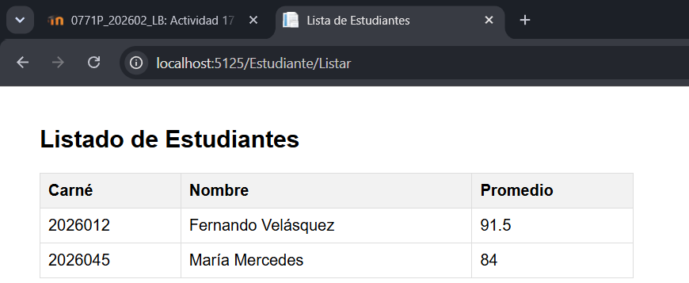
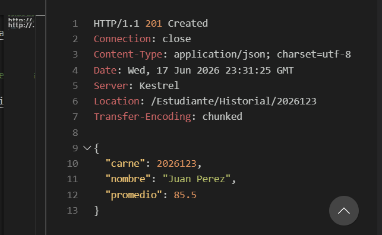
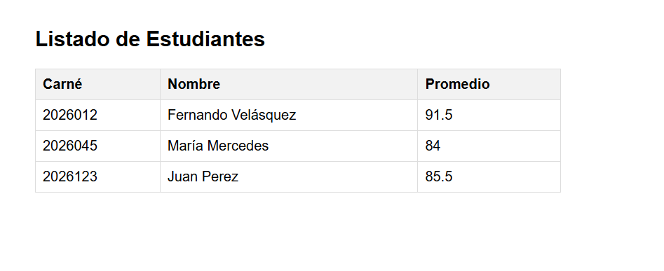

# Reporte de Laboratorio: Arquitectura Multi-Nivel (N-Tier) y Patrón Lógico de Software (MVC) en .NET

## Parte 1: Fundamentación Teórica y Análisis Crítico

### 1. El Tránsito hacia los Sistemas Distribuidos y Multi-Capa

**La Limitación del Monolito Local:**
Cuando la interfaz, la lógica y el almacenamiento residen de forma exclusiva en una máquina física aislada (monolito local), la sincronización y escalabilidad de los datos se ven severamente limitadas. La escalabilidad solo puede ser vertical (aumentar hardware de la misma máquina), lo que tiene un límite físico y económico. Además, cualquier fallo en la máquina compromete todo el sistema, impidiendo la disponibilidad de la información y generando cuellos de botella en el acceso y procesamiento de datos concurrentes.

**Distinción Crítica (Layers vs. Tiers):**
- **Capas Lógicas (Layers):** Se refieren a la organización lógica y separación de responsabilidades dentro del código de una aplicación (por ejemplo, organizar el código en carpetas lógicas dentro de un mismo proyecto).
- **Niveles Físicos (Tiers):** Se refieren a la distribución física de los componentes de software en diferentes servidores o máquinas de hardware. Un *tier* implica separación física, donde la comunicación se realiza a través de la red (por ejemplo, un servidor web en una máquina y un servidor de base de datos en otra).

**Responsabilidades en la Arquitectura de 3 Niveles:**
- **Nivel 1: Capa de Presentación (Presentation Tier):** Su misión exclusiva es interactuar con el usuario, capturar sus entradas y mostrarle la información (interfaz de usuario). Tecnología común: HTML, CSS, JavaScript, aplicaciones móviles, navegadores web.
- **Nivel 2: Capa de Aplicación o Negocio (Application Tier):** Su misión exclusiva es procesar la lógica de negocio, reglas de la aplicación, validaciones y cálculos. Actúa como intermediario entre la presentación y los datos. Tecnología común: ASP.NET Core, Node.js, Spring Boot, microservicios.
- **Nivel 3: Capa de Datos (Data Tier):** Su misión exclusiva es el almacenamiento, persistencia, recuperación y gestión de la información de manera segura. Tecnología común: Bases de datos relacionales (SQL Server, PostgreSQL, MySQL) o NoSQL (MongoDB, Redis).

**Seguridad Perimetral:**
Exponer públicamente el puerto de una base de datos a internet es un error crítico de seguridad porque la hace vulnerable a ataques de fuerza bruta, inyección SQL directa, ataques de denegación de servicio y explotación de vulnerabilidades conocidas del motor de base de datos. La buena práctica recomendada para su protección es aislar la base de datos en una red privada virtual (VPC) o subred privada, de modo que solo el servidor de aplicaciones (Nivel 2) pueda comunicarse con ella, actuando este último como una barrera de seguridad perimetral que valida y filtra las peticiones.

### 2. Desacoplamiento Lógico con el Patrón MVC

**La Crisis del Código Espagueti:**
Mezclar sentencias SQL, lógica matemática y etiquetas visuales dentro de un mismo archivo físico (código espagueti) tiene impactos muy negativos en el mantenimiento del software, ya que cualquier cambio en la interfaz puede romper la lógica o la base de datos, y hace que el código sea extremadamente difícil de leer y modificar. En cuanto al diseño de pruebas unitarias, se vuelve prácticamente imposible probar componentes de forma aislada (por ejemplo, probar la lógica matemática sin tener que levantar la base de datos y la interfaz gráfica).

**Separación de Preocupaciones (SoC):**
El patrón MVC aisla las responsabilidades de la siguiente manera:
- **Modelo:** Representa la lógica de negocio, las reglas y el estado de los datos de la aplicación. No debe conocer cómo se muestran los datos (independiente de la interfaz) para que la información pueda ser consumida por cualquier tipo de cliente (web, móvil, escritorio) sin modificar su lógica interna.
- **Vista:** Es una entidad *pasiva e inteligente*. Es responsable únicamente de mostrar la información al usuario de forma comprensible. Tiene estrictamente prohibido contener código de lógica de negocio o acceso directo a bases de datos; solo debe contener código para renderizar los datos recibidos (HTML, CSS, algo de lógica de presentación simple).
- **Controlador:** Su rol es de intermediario táctico y director de orquesta. Recibe las peticiones del usuario (a través de la Vista), procesa la entrada, interactúa con el Modelo para realizar la acción solicitada, y finalmente selecciona y devuelve la Vista adecuada con los resultados.

**Métricas de Ingeniería de Software:**
El patrón MVC ayuda a alcanzar una **Alta Cohesión** porque cada componente (Modelo, Vista, Controlador) tiene una única responsabilidad bien definida y enfocada, agrupando funcionalidades relacionadas. Al mismo tiempo, promueve un **Bajo Acoplamiento** porque los componentes no dependen directamente de las implementaciones internas de los otros (la Vista no conoce la base de datos, el Modelo no conoce el HTML), comunicándose a través de interfaces o estructuras de datos bien definidas, lo que permite modificar o reemplazar un componente sin afectar significativamente a los demás.

## Parte 2: Modelado del Ciclo de Vida y Enrutamiento Semántico

### 1. Mapeo Analítico de URLs

| URL Entrante del Cliente | Clase Controladora Buscada por el Framework | Método (Acción) Ejecutado | Parámetro id Inyectado |
| :--- | :--- | :--- | :--- |
| `https://ingenieria.usac.edu.gt/ControlAcademico/Login` | `ControlAcademicoController` | `Login` | *(Ninguno / Opcional)* |
| `https://ingenieria.usac.edu.gt/Estudiante/Historial/20260123` | `EstudianteController` | `Historial` | `20260123` |
| `https://ingenieria.usac.edu.gt/Asignacion/Detalle/10` | `AsignacionController` | `Detalle` | `10` |
| `https://ingenieria.usac.edu.gt/Home` | `HomeController` | `Index` (por defecto) | *(Ninguno / Opcional)* |

### 2. Diagramación del Flujo Interactivo

1. **Petición del Usuario:** El usuario hace clic en un botón o ingresa una URL en su navegador web, enviando una petición HTTP (GET, POST, etc.) al servidor.
2. **Enrutamiento y Controlador (Dispatcher):** El framework de ASP.NET Core recibe la petición, analiza la URL mediante su motor de enrutamiento y determina qué **Controlador** y qué método de acción (`Action`) debe manejar la solicitud.
3. **Interacción con el Modelo:** El **Controlador** recibe los parámetros de la petición. Si es necesario, interactúa con el **Modelo** para aplicar la lógica de negocio, consultar, actualizar o procesar los datos requeridos.
4. **Selección de la Vista:** El **Modelo** devuelve los datos procesados al **Controlador**. El Controlador toma estos datos y decide qué **Vista** debe ser renderizada para presentar la información al usuario, inyectándole los datos limpios del modelo.
5. **Renderizado y Respuesta:** La **Vista** toma los datos proporcionados por el Controlador, los combina con su plantilla (ej. HTML/Razor) para generar el código HTML final. Este HTML es enviado de vuelta como respuesta HTTP al navegador del usuario, que lo interpreta y lo muestra en pantalla.

## Parte 3: Implementación Práctica - Sistema de Control Académico

*El proyecto `ControlAcademicoMvc` ha sido creado y codificado siguiendo las instrucciones.*

## Parte 4: Auditoría y Control de Calidad (Imágenes de la Ejecución)

*Espacios para agregar las capturas de pantalla de la ejecución y verificación (Postman o Navegador):*

**Prueba de Cohesión (GET): /Estudiante/Listar**
**
[ Espacio para Imagen 1 ]

**Evaluación de Antipatrones (POST): /Estudiante/Registrar**
**
[ Espacio para Imagen 2 ]

## Parte 5: Referencias Bibliográficas

- Facultad de Ingeniería, USAC. (2026). Sesión 11: Modelado Base y Arquitecturas de Despliegue. Evolución de Sistemas Distribuidos, Fundamentos del Modelo Cliente-Servidor y Diseño Físico Multi-Capas (N-Tier). Laboratorio del curso Introducción a la Programación y Computación 2. Guatemala.
- Facultad de Ingeniería, USAC. (2026). Sesión 12: Arquitectura y Componentes del Patrón MVC. Desacoplamiento Lógico de Software, Ciclo de Vida de las Peticiones y Enrutamiento en Aplicaciones Interactivas Modernas. Laboratorio del curso Introducción a la Programación y Computación 2. Guatemala.
